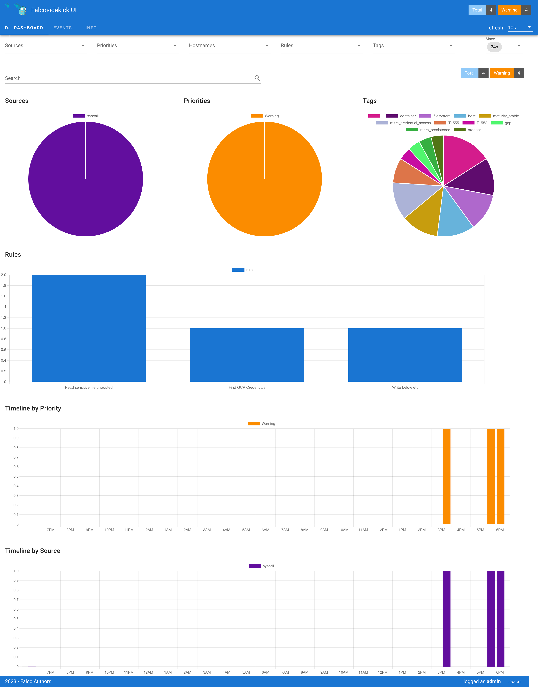
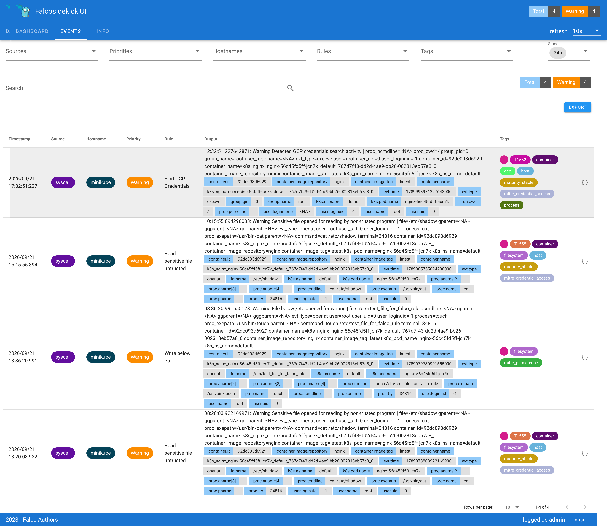

This repository is to practice Falco for runtime threat detection & alerting for hands on poc 

For practice, I followed the Falco official document, including: 
https://falco.org/docs/getting-started/falco-kubernetes-quickstart/ 

Falco Dashboard: 
 

Falco Events: 
 